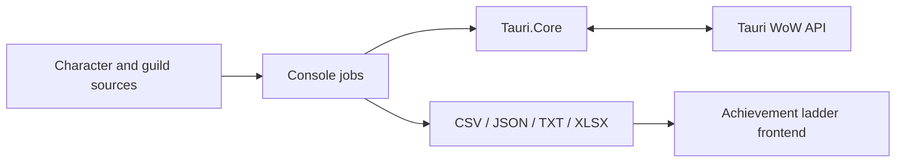

# Tauri Achievement Ladder

[](https://github.com/HunorTotBagi/tauri-achievement-ladder-backend/actions/workflows/ci.yml)
[](https://github.com/HunorTotBagi/tauri-achievement-ladder-backend/actions/workflows/secret-scan.yml)

A .NET 10 batch-processing toolkit that builds achievement leaderboards and guild reports
from the Tauri WoW API. It collects characters from multiple sources, enriches them through
concurrent API calls, normalizes inconsistent responses, and publishes deterministic CSV,
JSON, text, and Excel outputs for a companion frontend.

This is a suite of one-shot ETL-style console applications—not an HTTP API. The project
focuses on external API integration, resilient high-volume processing, data consistency,
and durable file-based publishing.

## Engineering highlights

- Bounded parallelism with configurable request concurrency
- Per-request timeouts and exponential retry backoff with jitter
- Graceful cancellation using `CancellationToken`
- Retry queues and persistent resume state for interrupted jobs
- Atomic output replacement to prevent partially published files
- Defensive parsing of inconsistent third-party JSON
- Deterministic normalization, deduplication, and ordering
- xUnit unit and service tests with fake API responses and Coverlet coverage
- .NET 10 CI builds and Gitleaks secret scanning

## Architecture



`Tauri.Core` contains shared configuration, HTTP transport, response mapping, realm
normalization, achievement extraction, and item-appearance logic. Each executable owns one
workflow and its output contract.

| Project | Purpose |
| --- | --- |
| `AchievementLadder` | Builds the player leaderboard and rare-achievement export. |
| `GuildCharacterExporter` | Expands configured guilds into character sources. |
| `MissingPlayerFinder` | Backfills characters absent from an existing export. |
| `RealmFirstAchievements` | Rebuilds and validates realm-first character sources. |
| `BattlegroundCollector` | Collects sequential PvP matches with resumable state. |
| `Guildkukker` | Generates ranked guild reports with reputation, artifact, and item-level data. |
| `EndlessGuildExporter` | Produces a formatted Excel guild roster. |

## Processing model

1. Load, normalize, and deduplicate character or guild targets.
2. Fetch workflow-specific data through the shared, concurrency-limited API client.
3. Map unstable external responses into stable internal and export models.
4. Sort results deterministically and write them to temporary files.
5. Atomically publish completed outputs and preserve failures for retry.

The main scan treats a character as one consistent snapshot: achievements, appearances, and
the minimal character sheet must all succeed before publication. Transient HTTP, network,
timeout, and invalid-response failures are retried. Unresolved targets are recorded for the
next run rather than silently discarded.

## Technology

- .NET 10, C#, nullable reference types
- `HttpClient`, `System.Text.Json`
- `Parallel.ForEachAsync`, `SemaphoreSlim`, concurrent collections
- CSV, JSON, text, and Open XML `.xlsx` generation
- xUnit, Coverlet, GitHub Actions, Gitleaks

The solution intentionally has no database or web server. File-based publishing is a conscious
fit for its static frontend and scheduled batch workflow.

## Quick start

Requirements: .NET 10 SDK, valid Tauri API credentials, and the companion frontend repository
beside this repository for commands that publish directly to its `src` directory.

```powershell
Copy-Item AchievementLadder/appsettings.example.json AchievementLadder/appsettings.json
$env:TAURI_API_APIKEY = "your-api-key"
$env:TAURI_API_SECRET = "your-api-secret"
dotnet run --project AchievementLadder
```

The local `appsettings.json` is ignored by Git. Environment variables can also configure
concurrency, timeouts, and retry behavior; see
[`appsettings.example.json`](AchievementLadder/appsettings.example.json) for available values.

## Commands

| Task | Command |
| --- | --- |
| Build the leaderboard | `dotnet run --project AchievementLadder` |
| Refresh guild character sources | `dotnet run --project GuildCharacterExporter` |
| Backfill missing players | `dotnet run --project MissingPlayerFinder` |
| Validate realm-first characters | `dotnet run --project RealmFirstAchievements` |
| Collect battlegrounds | `dotnet run --project BattlegroundCollector -- 95874` |
| Export a ranked guild report | `dotnet run --project Guildkukker -- Evermoon Endless` |
| Export the Endless workbook | `dotnet run --project EndlessGuildExporter` |

Commands with additional options expose usage through `--help` or document their arguments
at startup.

## Tests and CI

The solution contains 28 focused tests covering:

- Character-age calculation and date normalization
- Rare-achievement parsing across valid, missing, and malformed payloads
- Item-appearance counting and character mapping
- Realm normalization
- CSV escaping and JSON serialization
- Successful and failed per-character synchronization through a fake `ITauriApiClient`

Run the same Release validation used by CI:

```powershell
dotnet restore AchievementLadder.sln
dotnet build AchievementLadder.sln --configuration Release --no-restore
dotnet test AchievementLadder.sln --configuration Release --no-build
```

CI uploads Cobertura coverage reports as workflow artifacts. End-to-end scans are deliberately
excluded because they require live credentials and depend on an external API.

## Trade-offs and limitations

- Throughput is constrained by external API latency and rate limits.
- Defensive `JsonElement` parsing remains necessary for several inconsistent response shapes.
- Some commands currently expect the companion frontend as a sibling repository.
- A custom Excel writer implements only the Open XML features required by these reports.
- Several large exporter services still contain parsing, orchestration, and presentation logic
  that should be separated incrementally.

## Roadmap

- Adopt Generic Host, dependency injection, typed options, and structured logging
- Register the API client through `IHttpClientFactory` and introduce typed response contracts
- Split large exporters into orchestration, transformation, and persistence components
- Expand integration and output-contract tests across the remaining workflows
