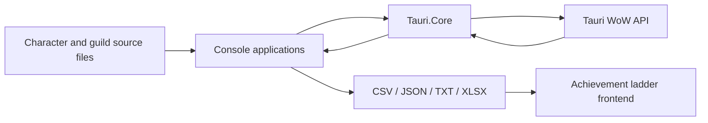

# Tauri Achievement Ladder

A .NET 9 batch-processing and ETL toolkit that builds achievement leaderboards and
guild reports from the Tauri WoW API. It collects character data from several local
sources, enriches it through API calls, normalizes inconsistent responses, and publishes
deterministic CSV, JSON, text, and Excel outputs for the companion frontend.

This repository is a suite of one-shot console applications, not an HTTP API. Its backend
responsibilities are external API integration, concurrent data collection, transformation,
validation, retry handling, and durable file-based publishing.

## Engineering highlights

- Bounded parallel API processing with configurable concurrency
- Request timeouts and exponential retry backoff with jitter
- Graceful cancellation through `CancellationToken`
- Retry files for incomplete character and guild scans
- Resume state for long-running battleground collection
- Atomic output replacement through temporary files
- Defensive parsing of inconsistent third-party JSON
- Deterministic deduplication and ordering
- Shared API, mapping, and domain logic in `Tauri.Core`
- Automated secret scanning with Gitleaks

## Architecture



`Tauri.Core` owns shared configuration, API transport, response mapping, achievement
extraction, item-appearance counting, realm mapping, and project-path resolution. Each
executable owns one workflow and its output contract.

| Project | Responsibility |
| --- | --- |
| `AchievementLadder` | Produces the complete player leaderboard and rare-achievement export. |
| `GuildCharacterExporter` | Expands configured guilds into character source rows. |
| `MissingPlayerFinder` | Backfills characters missing from an existing leaderboard export. |
| `RealmFirstAchievements` | Rebuilds and validates realm-first character sources. |
| `BattlegroundCollector` | Collects sequential PvP matches with persistent resume state. |
| `Guildkukker` | Produces a detailed, ranked guild report with reputation, artifact, and item-level data. |
| `EndlessGuildExporter` | Produces a formatted Excel roster for the Endless guild. |

## Data flow

1. Character and guild targets are loaded from versioned text files.
2. Targets are normalized and deduplicated by character and realm.
3. Workers fetch achievements, appearances, character sheets, or workflow-specific data.
4. API responses are mapped into stable internal and export models.
5. Results are sorted deterministically and written to temporary files.
6. Completed temporary files replace the published outputs atomically.
7. Incomplete targets are written to retry files for a later run.

The main ladder reads from:

- `AchievementLadder/Data/CharacterCollection/*.txt`
- `AchievementLadder/Data/GuildCharacters/GuildCharacters.txt`
- `AchievementLadder/Data/PvPSeasonCharacters/*.txt`
- `AchievementLadder/Data/AdditionalCharacters/tauri-ban-list.txt`
- `AchievementLadder/Data/AdditionalCharacters/vengeful.txt`

## Resilience and consistency

The shared API client limits simultaneous requests and connections, applies a per-request
timeout, and retries transient HTTP, network, timeout, and invalid-response failures. Retry
delays use exponential backoff with random jitter and honor the server's `Retry-After` header.

Each character in the main scan is treated as one complete snapshot: achievement,
appearance, and minimal-sheet requests must all succeed before the character is published.
Failed or incomplete targets are kept in `MissingPlayersToScan.txt`. Guild exporting uses
the equivalent `MissingGuildsToScan.txt` workflow and merges successful retries into the
existing source. The battleground collector persists the next match ID so interrupted runs
can resume safely.

Output files are produced through a write-then-move pattern. Consumers therefore see the
previous complete file or the new complete file, rather than a partially written export.

## Technology

- .NET 9 and C# with nullable reference types enabled
- `HttpClient` and `System.Text.Json`
- `Parallel.ForEachAsync`, `SemaphoreSlim`, and concurrent collections
- CSV, JSON, text, and Open XML `.xlsx` generation
- GitHub Actions and Gitleaks

The project intentionally has no database or web server. Versioned source files and generated
artifacts fit its current batch-publishing workflow and keep deployment lightweight.

## Quick start

Requirements:

- .NET 9 SDK
- Valid Tauri API credentials
- The companion `tauriachievements.github.io` repository beside this repository when running
  commands that publish directly to its `src` directory

Create the ignored local configuration:

```powershell
Copy-Item AchievementLadder/appsettings.example.json AchievementLadder/appsettings.json
```

Set credentials in the current PowerShell session and run the main export:

```powershell
$env:TAURI_API_APIKEY = "your-api-key"
$env:TAURI_API_SECRET = "your-api-secret"
dotnet run --project AchievementLadder
```

Supported environment variables are:

- `TAURI_API_BASEURL`
- `TAURI_API_APIKEY`
- `TAURI_API_SECRET`
- `TAURI_API_MAX_CONCURRENT_REQUESTS`
- `TAURI_API_REQUEST_TIMEOUT_SECONDS`
- `TAURI_API_MAX_RETRY_ATTEMPTS`
- `TAURI_API_INITIAL_RETRY_DELAY_MS`

`AchievementLadder/appsettings.json` is ignored by Git and must never be committed. Pushes
and pull requests are scanned for secrets by Gitleaks. Credentials found in Git history must
be rotated because deleting them from the current revision does not invalidate them.

## Commands

### Build the leaderboard

```powershell
dotnet run --project AchievementLadder
```

Publishes `Players.csv`, `RareAchievements.json`, and `lastUpdated.txt` to the companion
frontend. `RareAchievements.json` includes the exported catalog and each character's matching
achievement IDs and obtained dates. Incomplete characters are written to
`MissingPlayersToScan.txt`.

### Refresh guild character sources

```powershell
dotnet run --project GuildCharacterExporter
```

Writes `Character-Realm` rows to `GuildCharacters.txt`. If `MissingGuildsToScan.txt` exists,
the next run processes those retry targets and merges successful results into the existing
character source.

### Backfill missing players

```powershell
dotnet run --project MissingPlayerFinder
```

Compares the configured sources with `Players.csv`, fetches absent characters, appends
complete results, refreshes related metadata, and retains unresolved targets for retry.

### Validate realm-first characters

```powershell
dotnet run --project RealmFirstAchievements
dotnet run --project RealmFirstAchievements -- --parallelism 30
```

Rebuilds the validated realm-first character source. `--parallelism` overrides API request
parallelism for that run.

### Collect battlegrounds

Seed the first run with a known match ID:

```powershell
dotnet run --project BattlegroundCollector -- 95874
```

Later runs can resume from saved state:

```powershell
dotnet run --project BattlegroundCollector
```

The collector stops at the first missing match, prepends new records to `battlegrounds.json`,
and records the next ID in `battleground-collector-state.json`. Run with `--help` for realm,
output, and state-path options.

### Export a ranked guild report

```powershell
dotnet run --project Guildkukker -- Evermoon Endless
dotnet run --project Guildkukker -- Evermoon Endless --output-directory "C:\Exports"
```

Produces aligned text and Excel reports for level 110 guild members. Rows include Nightfallen
reputation, the highest-trait artifact and relics, specialization, and calculated equipped
item level. Results are ranked by reputation bracket and current reputation. Realm aliases
`Evermoon`, `Tauri`, and `WoD` are expanded to their API names automatically.

### Export the Endless guild workbook

```powershell
dotnet run --project EndlessGuildExporter
dotnet run --project EndlessGuildExporter -- --output "C:\Exports\Endless.xlsx"
```

Produces a formatted workbook containing guild roster, class, race, profession, artifact,
and related character details when those fields are available from the API.

## Sanitized sample output

Main scan summary:

```text
Scanning 12,450 characters...
API settings: concurrency=50, timeout=30s, retries=8
Generated 12,318 player rows.
Characters needing retry: 132
Players.csv: <frontend>/src/Players.csv
RareAchievements.json: <frontend>/src/RareAchievements.json
```

Example player CSV row:

```csv
"Name","Race","Gender","Class","Realm","Guild","AchievementPoints","HonorableKills","Faction","AppearanceCount","CharacterAge","PlayedTime","AchievementsTotal"
"Examplemage",1,0,8,"Evermoon","Example Guild",15420,8421,"Alliance",1375,"8 years",12500000,1865
```

Values above are illustrative and contain no real credentials or player data.

## Testing and quality

The solution currently builds with nullable reference types enabled and is scanned for secrets
in CI. Automated unit and integration tests have not been added yet. The highest-value planned
coverage is deterministic response parsing, character mapping, item-level calculation, CSV
round trips, retry classification, deduplication, and interrupted-run recovery.

Build the complete solution with:

```powershell
dotnet build AchievementLadder.sln
```

## Known limitations

- The Tauri API can return inconsistent or missing fields, requiring defensive parsing.
- Scan duration and throughput depend on external API latency and rate limits.
- The main publishing commands expect a sibling frontend repository and use file-based
  integration rather than configurable remote storage.
- A character is excluded from the main export when any required endpoint remains incomplete
  after retries.
- Some item-level rules compensate for known legacy API data issues, including artifact
  off-hand and item-level normalization cases.
- The custom Excel writer supports the workbook features required here, not the complete Open
  XML specification.
- The repository does not yet contain automated tests.

## Roadmap

- Adopt the .NET Generic Host, dependency injection, typed options, and structured logging
- Register the Tauri API through `IHttpClientFactory`
- Replace broad `JsonElement` handling with endpoint-specific transport contracts
- Split large exporters into orchestration, parsing, domain, and persistence components
- Add unit, integration, and output-contract tests with coverage reporting
- Add build, formatting, analyzer, and test checks to CI
- Make output locations explicit configuration instead of relying on sibling repositories
- Add metrics for request latency, retry counts, failure categories, and throughput
